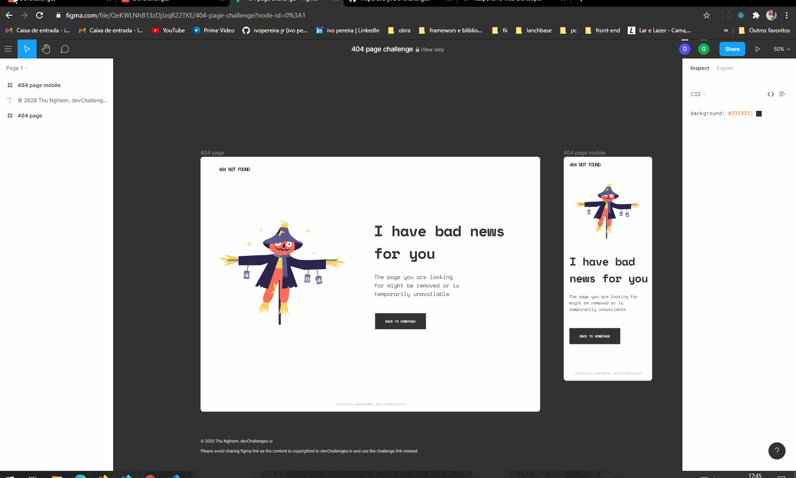

<!-- Please update value in the {}  -->

<h1 align="center">404 NOT FOUND</h1>

   Solution for a challenge from  <a href="http://devchallenges.io" target="_blank">Devchallenges.io</a>.

  <h3>
    <a href="https://not-found.vercel.app/">
      Demo
    </a>
     | 
    <a href="https://github.com/ivopereira-jr/Devchallenges/tree/main/404-NOT-FOUND">
      Solution
    </a>
     | 
    <a href="https://devchallenges.io/challenges/wBunSb7FPrIepJZAg0sY">
      Challenge
    </a>
  </h3>

<!-- TABLE OF CONTENTS -->

## Table of Contents

- [Overview](#overview)
- [Features](#features)
- [Contact](#contact)

<!-- OVERVIEW -->

## Overview

 

 
 

- Where can I see your demo? 
- What was your experience? 
  It was great I was able to put my knowledge into practice and solve the challenge.
- What have you learned/improved? 
  flex display
- Your wisdom? :) 
  Jr

 

## Features

This application/site was created as a submission to a [DevChallenges](https://devchallenges.io/challenges) challenge. The [challenge](https://devchallenges.io/challenges/wBunSb7FPrIepJZAg0sY) was to build an application to complete the given user stories.

 

## Contact

- Linkedin [ivopereira-jr](https://www.linkedin.com/in/ivopereira-jr/)
- GitHub [@ivopereira-jr](https://github.com/ivopereira-jr)
